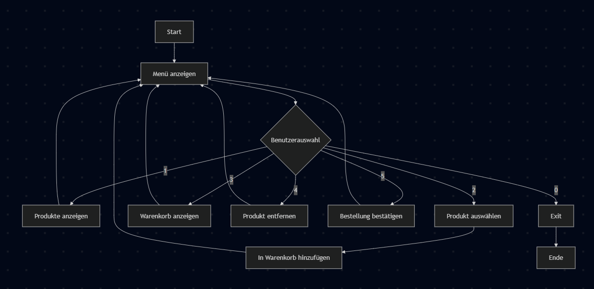
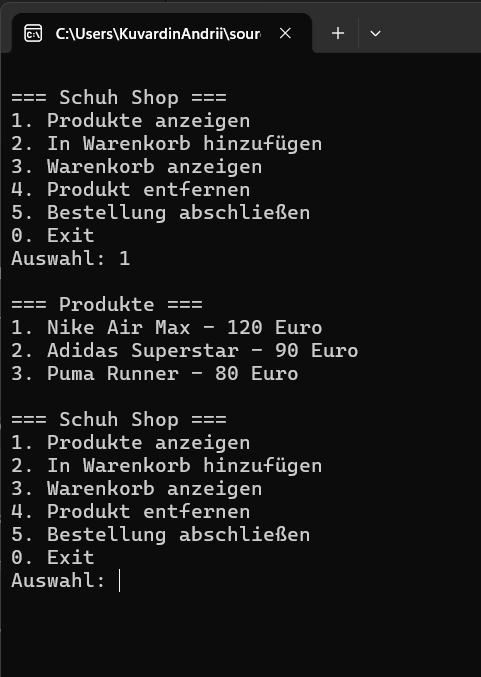
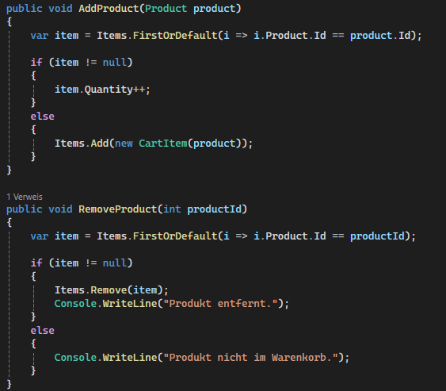

# Mini Schuhshop

## Inhaltsverzeichnis
1. Projektidee
2. Projektantrag / Planung
3. Funktionen
4. Klassenstruktur
5. Zeitplanung
6. Implementierung und Umsetzung
7. Probleme und Lösungen
8. Technische Umsetzung
9. Flowchart
10. Screenshots
11. Fazit
12. Quellen

---

## 1. Projektidee

Im Rahmen dieses Projekts habe ich eine Konsolenanwendung in C# entwickelt, die einen einfachen Schuhshop simuliert.

Das Thema habe ich gewählt, da ich bereits in der Schuhbranche gearbeitet habe und einen praktischen Bezug dazu habe.

Die Anwendung ermöglicht es dem Benutzer, Produkte anzusehen, in den Warenkorb zu legen und eine Bestellung abzuschließen.

---

## 2. Projektantrag / Planung

Ziel des Projekts war die Entwicklung eines funktionalen Mini-Shops als Konsolenanwendung.

Geplante Funktionen:
- Anzeige von Produkten
- Warenkorb
- Bestellung

Der Fokus lag auf objektorientierter Programmierung und klarer Struktur.

---

## 3. Funktionen

Die Anwendung bietet folgende Funktionen:

- Anzeige der verfügbaren Produkte
- Hinzufügen von Produkten in den Warenkorb
- Anzeige des Warenkorbs
- Entfernen von Produkten
- Berechnung des Gesamtpreises
- Abschluss der Bestellung

---

## 4. Klassenstruktur

Die Anwendung besteht aus folgenden Klassen:

- **Product**
  - Speichert Informationen über ein Produkt (Id, Name, Preis)

- **CartItem**
  - Verbindet ein Produkt mit einer Menge

- **Cart**
  - Verwaltet den Warenkorb und enthält die Logik

- **Program**
  - Steuerung der Anwendung und Benutzerinteraktion

---

## 5. Zeitplanung

| Tag   | Aufgabe                                          |
|-------|--------------------------------------------------|
| Tag 1 | Projekt erstellen, GitHub einrichten, Struktur   |
| Tag 2 | Product Klasse und Produktliste                  |
| Tag 3 | Menü und Benutzer-Eingaben                       |
| Tag 4 | Warenkorb (hinzufügen)                           |
| Tag 5 | Warenkorb erweitern (anzeigen, entfernen, Summe) |
| Tag 6 | Finalisierung und Fehlerbehandlung               |
| Tag 7 | Präsentation                                     |

---

## 6. Implementierung und Umsetzung

### Tag 1
Projekt erstellt und GitHub eingerichtet.  
Grundlegende Klassenstruktur angelegt.

### Tag 2
Klasse `Product` implementiert.  
Produkte wurden als Liste erstellt und in der Konsole ausgegeben.

### Tag 3
Ein Menü wurde erstellt.  
Benutzereingaben werden über `Console.ReadLine()` verarbeitet.

### Tag 4
Warenkorb implementiert.  
Produkte können über die ID ausgewählt und hinzugefügt werden.

### Tag 5
Warenkorb erweitert:
- Anzeige
- Entfernen
- Berechnung des Gesamtpreises

### Tag 6
Finalisierung:
- Bestellung abschließen
- Fehlerbehandlung mit `TryParse`
- Benutzerführung verbessert

---

## 7. Probleme und Lösungen

### Problem 1: Doppelte Klasse Product
Die Klasse wurde zweimal definiert.

**Lösung:**  
Die Klasse wurde in eine separate Datei ausgelagert.

---

### Problem 2: Fehlerhafte Eingaben
Benutzer konnten falsche Werte eingeben.

**Lösung:**  
Verwendung von `int.TryParse()` zur Validierung.

---

### Problem 3: Produkt nicht gefunden
Bei falscher ID wurde kein Produkt gefunden.

**Lösung:**  
Überprüfung mit einer Suchmethode (`FirstOrDefault`).

---

## 8. Technische Umsetzung

Die Anwendung wurde mit objektorientierter Programmierung umgesetzt.

Ein wichtiger Aspekt ist die Warenkorb-Logik:

- Produkte werden anhand der ID gesucht
- Wenn ein Produkt bereits im Warenkorb vorhanden ist, wird die Menge erhöht
- Die Berechnung des Gesamtpreises erfolgt über eine Methode


Beispiel:

```csharp
var item = Items.FirstOrDefault(i => i.Product.Id == product.Id);
```

## 9. Flowchart

Das Diagramm zeigt den Ablauf der Anwendung.

## 10. Screenshots

Die Abbildung zeigt die Ausgabe des Programms in der Konsole.


Hier ist ein wichtiger Teil der Warenkorb-Logik dargestellt.

## 11. Fazit
Das Projekt erfüllt die gesetzten Ziele und funktioniert vollständig.
Die Anwendung bietet alle geplanten Funktionen eines einfachen Shops.
Besonders wichtig war die Umsetzung der Warenkorb-Logik sowie die Arbeit mit Klassen und Methoden.
Ich konnte meine Kenntnisse in C# und objektorientierter Programmierung deutlich verbessern.

## 12. Quellen

Unterrichtsmaterialien
Eigene Recherche
ChatGPT (Unterstützung bei Struktur und Verständnis)

## 13. Verwendete Technologien:
- C#
- .NET Console Application
- Visual Studio
- GitHub